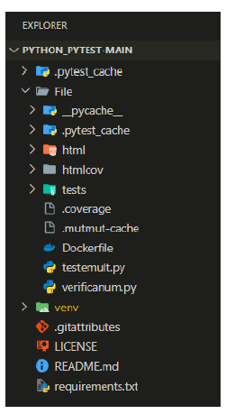
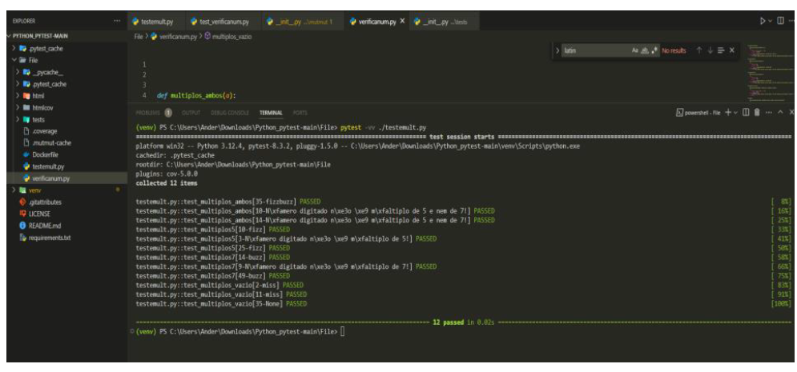
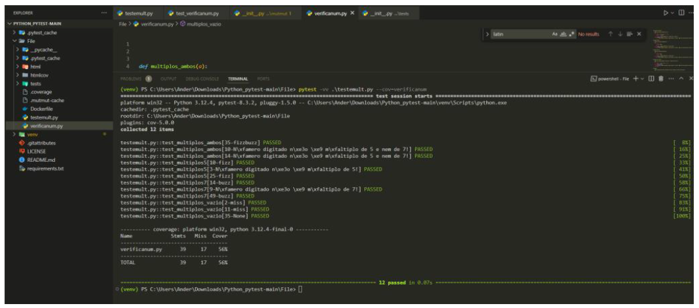
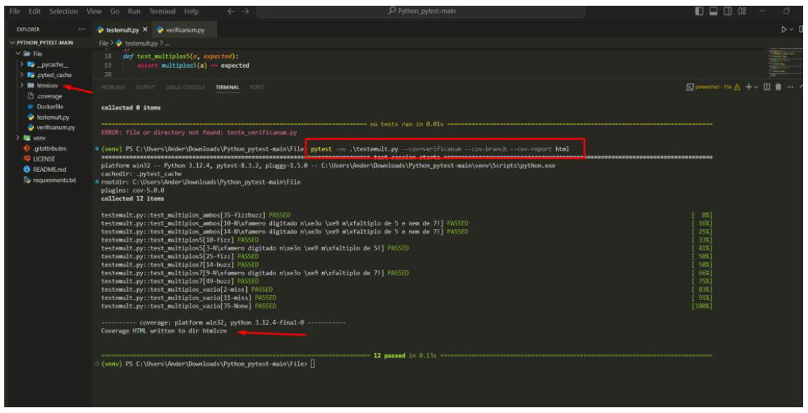
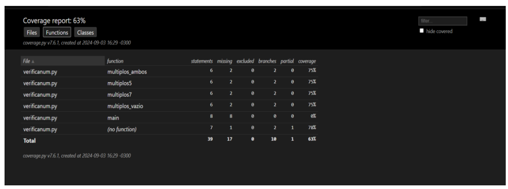
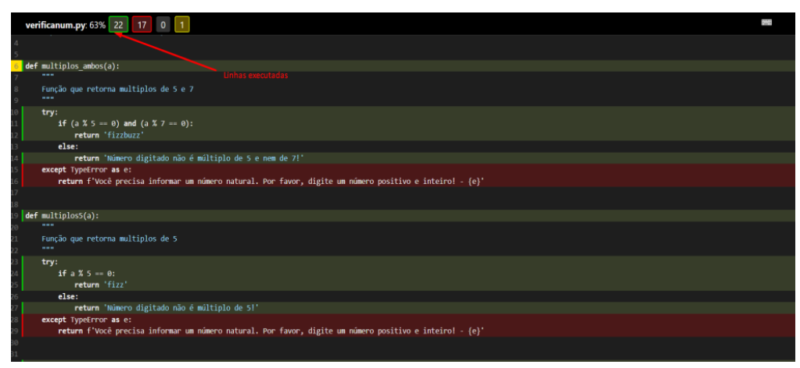
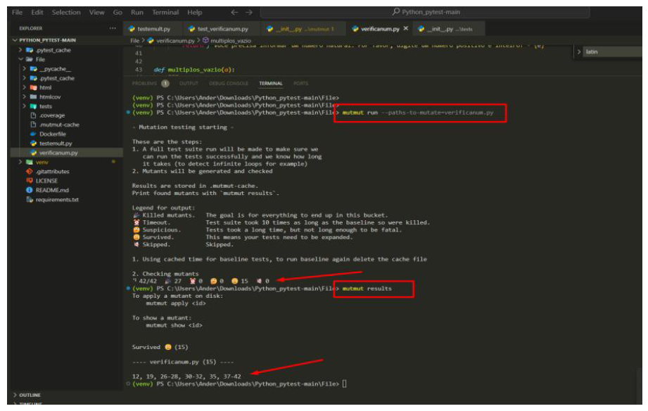
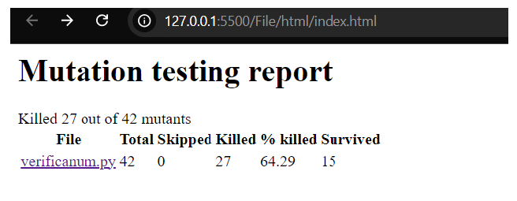
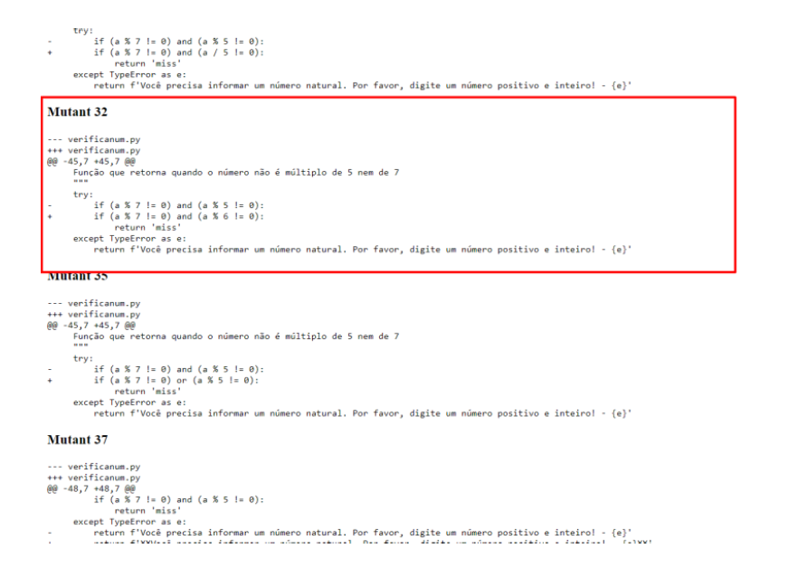
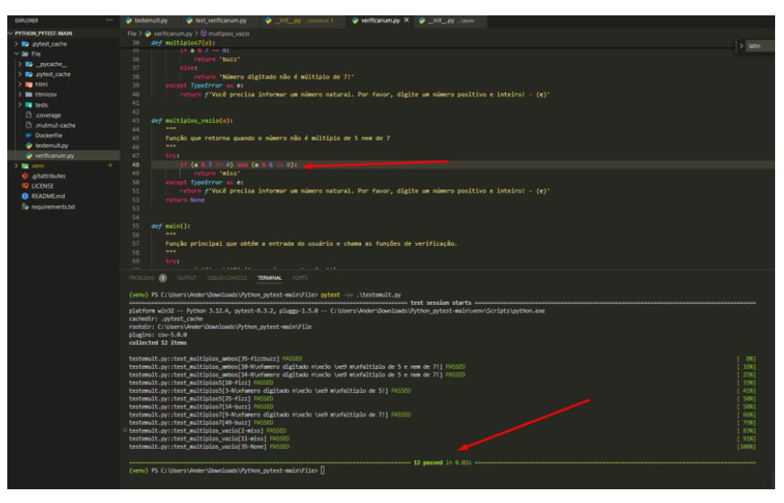

## DISCIPLINA TESTE DE SOFTWARE
## **ANDERSON COSTA MOREIRA SANTANA**
### ATIVIDADE 2

## **TUTORIAL**
### link do GitHub: https://github.com/Anderson-SI/Teste_Software_Mutantes_2024_Santana_Anderson

&nbsp;&nbsp;&nbsp;Descrição das etapas percorridas para conclusão da atividade.

&nbsp;&nbsp;&nbsp;Nessa atividade foi selecionado um projeto do GitHub, link do projeto https://github.com/GaabrielCoosta/Python_pytest/tree/main, cujo o objetivo era fazer testes de cobertura de código e de mutação como forma de aplicar o conhecimento apreendido em sala de aula, além disso, seguimos alguns passos sugeridos pelo professor tendo como referência o vídeo de Stevão Andrade disponibilizado em seu canal no Youtube, link do vídeo https://www.youtube.com/watch?v=FbMpoVOorFI, inicialmente foram conferidas todas as bibliotecas necessárias para execução da atividade, instalação do python3+, pytest, pytest-cov, mutmut, python3-venv e o vscode. Destas, a que eu não tinha instalado em minha máquina era o Virtualenv criador de ambiente virtual Python. Prosseguindo com os testes baixei o projeto do Github como arquivo .zip e apesar de ser um projeto simples com 2 arquivos um chamado verificanum.py e testemult.py foi possível aplicar os testes e obter muito conhecimento. Basicamente o programa é um conjunto de funções que verificam se um número natural é múltiplo de 5, 7, ambos, ou nenhum dos dois. Cada função tem um propósito específico. Por exemplo a função multiplos_ambos(): Verifica se o número é múltiplo de 5 e 7 (ou seja, múltiplo de 35) e imprime "fizzbuzz". Função multiplos5(): Verifica se o número é múltiplo de 5 e imprime "fizz". Função multiplos7(): Verifica se o número é múltiplo de 7 e imprime "buzz". Função multiplos_vazio(): Verifica se o número não é múltiplo de 5 nem de 7 e imprime "miss". No entanto, após, conferir todo o programa vi que as classes de teste e a principal precisava fazer alguns ajustes por que os casos de testes não estavam bem definidos e os métodos da classe principal estavam mal projetados, após, feito todas configurações necessárias criei o ambiente virtual para prosseguir com os testes. A seguir imagem mostrando a estrutura de pastas do projeto após o ambiente está configurado.

  

&nbsp;&nbsp;&nbsp;Prosseguindo com os testes rodei o comando pytest -vv .\verificanum.py obtivemos o seguinte resultado.

  

&nbsp;&nbsp;&nbsp;Em seguida para verificar a percentagem de coberto de testes rodei o seguinte comando pytest -vv .\testemult.py --cov=verificanum e obtive o seguinte resultado.

  

&nbsp;&nbsp;&nbsp;Em seguida rodei o seguinte comando pytest -vv .\testemult.py --cov=verificanum --cov-branch --cov-report html para obter o relatório em um arquivo index.html.

  

&nbsp;&nbsp;&nbsp;Abaixo a imagem arquivo index.html demonstrando a quantidade de comando, percas, quantidade de branches e a percentagem de cobertura.

  

&nbsp;&nbsp;&nbsp;Abaixo imagem do arquivo index.html demonstrando a quantidade de linhas executadas em verde, linhas não executadas em vermelho e executadas parcialmente em amarelo.

  

&nbsp;&nbsp;&nbsp;Após esses testes fiz testes de mutação com o comando mutmut run --paths-to-mutate=verificanum.py obtendo o seguinte resultado .

  

&nbsp;&nbsp;&nbsp;Analisando o arquivo index.html gerado foi observado que muitos dos mutantes são principalmente variações no tratamento de erros e na lógica de verificação de múltiplos, bem como mudanças no comportamento de entrada/saída.

  

&nbsp;&nbsp;&nbsp;Então a título de exemplo peguei a alteração feita pelo mutante 32 indicando pela área em vermelho para fazer a verificação onde indica que mesmo que tenha alteração sugerida no código o teste passou ou seja, não matando o mutante.

  

&nbsp;&nbsp;&nbsp;Imagem da alteração feita no código

  

&nbsp;&nbsp;&nbsp;Os testes passaram demostrando que alguns testes não são bons o suficiente para conseguir matar o mutante mas, no geral para o percentagem de 63% de coberto de código é relativamente aceitável
